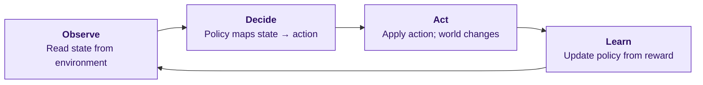
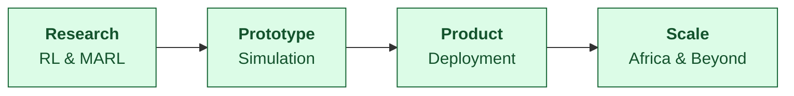

import { Cards, Callout } from 'nextra/components'

# About Rexplore Research Labs

**Rexplore Labs** is an AI research and product development lab focused on
building autonomous, learning-driven systems for real-world environments.

Our work centers on **Reinforcement Learning (RL)**, **multi-agent systems**,
and **scalable decision-making** — developing agents that learn through
interaction, coordination, and adaptation.

We combine fundamental research with product engineering to design and deploy
systems that operate under real-world constraints, including limited
infrastructure and high-uncertainty settings. Our research spans
reinforcement learning, distributed systems, and applied AI, enabling the
development of reliable and adaptive intelligent systems.

At Rexplore Labs, we build systems that **explore, collaborate, and make
decisions at scale** — driving practical impact across industries in Africa
and globally.

## Our Philosophy

Many believe AGI will emerge from scaling language models. There's no doubt
these systems are powerful — they've pushed AI forward and unlocked
incredible applications. But we don't believe true intelligence comes from
predicting the next token or manipulating language.

> **Language is not intelligence. It's a reflection of it.**

Real intelligence is the ability to **understand, act, and make decisions in
the world**. Today's models learn from human data. Even RLHF is still humans
guiding behavior through preferences. Intelligence should not depend on
imitation — it should emerge from interaction.

Look at a cat. No one teaches it explicitly what is right or wrong. It
learns by acting, observing outcomes, and adapting its behavior. *That* is
intelligence.

That's why at Rexplore Research Labs we focus on advancing reinforcement
learning and autonomous agents — not just models that talk, but systems that
learn, adapt, and operate in the real world.

## Our Divisions & Products

Each division turns our core research in Reinforcement Learning and
Multi-Agent Systems into products that solve specific, high-impact problems.

<Cards num={2}>
  <Cards.Card arrow title="Voxtra — Voice AI Infrastructure" href="/voxtra">
    <>Open-source voice AI platform bridging telephony systems like Asterisk with AI providers. Build production-ready voice agents in Python with just a few lines of code.</>
  </Cards.Card>
  <Cards.Card arrow title="Luso8 Cloud — Intelligent GTM" href="https://luso8.com">
    <>The intelligent GTM platform that helps businesses discover customers, automate engagement, and expand across the AfCFTA's $3.4 trillion market.</>
  </Cards.Card>
  <Cards.Card arrow title="Industrial Automation" href="https://rexplore.ai/industrial">
    <>The intelligence layer for industrial autonomy — Multi-Agent RL systems that coordinate robot fleets, optimize production, and enable safe human-robot collaboration.</>
  </Cards.Card>
  <Cards.Card arrow title="Research Lab" href="https://rexplore.ai/research">
    <>Foundational research in Reinforcement Learning, multi-agent systems, AI safety, and adaptive intelligence — the scientific foundation that powers all our products.</>
  </Cards.Card>
</Cards>

### From research to deployed systems

We don't just publish papers — we turn research into products, platforms,
and divisions that solve real challenges. From voice AI infrastructure to
industrial robotics coordination, our work spans the full path from
fundamental science to deployed systems, with a focus on Africa's unique
opportunities.

## Active Products

### Voxtra

Open-source voice AI platform for building multilingual voice agents,
speech-to-text pipelines, and conversational systems — designed for African
languages and beyond.

- Voice Agent SDK
- Multilingual STT / TTS
- Real-time pipelines
- Edge deployment

[Read the Voxtra docs →](/voxtra) · [GitHub](https://github.com/rexplore-ai/voxtra) · [PyPI](https://pypi.org/project/voxtra/)

### Luso8 Cloud

Intelligent GTM platform for African markets. Customer discovery, automated
engagement, and AfCFTA expansion across 54 countries / 1.3B people.

- Customer discovery
- Automated engagement
- AfCFTA expansion
- AI-powered GTM

[Visit Luso8 Cloud →](https://luso8.com)

### Industrial Automation Division

The intelligence layer for industrial autonomy. We are building Multi-Agent
RL systems that coordinate robot fleets, optimize production lines, and
enable safe human-robot collaboration.

- Fleet orchestration
- Adaptive scheduling
- Digital twin simulation
- Safe autonomy (ISO/TS 15066, ISO 10218-2:2025)

## Our Services

| Service           | What we do                                                               |
| ----------------- | ------------------------------------------------------------------------ |
| **AI Research**   | Foundation models, multimodal AI, reinforcement learning, AI safety.     |
| **AI Solutions**  | Custom AI models, integration, performance optimization, scalable arch.  |
| **AI Consulting** | AI strategy, technical consulting, team training, implementation roadmaps. |

## Company

| Field         | Value                                                              |
| ------------- | ------------------------------------------------------------------ |
| Industry      | Technology, Information & Internet                                 |
| Headquarters  | Lilongwe, Central Region, Malawi                                   |
| Founded       | 2025                                                               |
| Size          | 2 – 10 employees                                                   |
| Website       | [https://rexplore.ai](https://rexplore.ai)                         |
| Phone         | +265 996 668 149                                                   |
| Email         | [hello@rexplore.ai](mailto:hello@rexplore.ai)                      |

### Specialties

AI · Machine Learning · LLMs · Generative AI · Agentic AI ·
**Reinforcement Learning** · Deep Learning · Deep Reinforcement Learning ·
Research · **Multi-Agent Reinforcement Learning**

## Get in touch

<Callout type="info">
  Ready to explore how AI can transform your business? Let's start a conversation.
</Callout>

- **Email** — [hello@rexplore.ai](mailto:hello@rexplore.ai)
- **Phone** — +265 996 668 149
- **Location** — Lilongwe, Malawi
