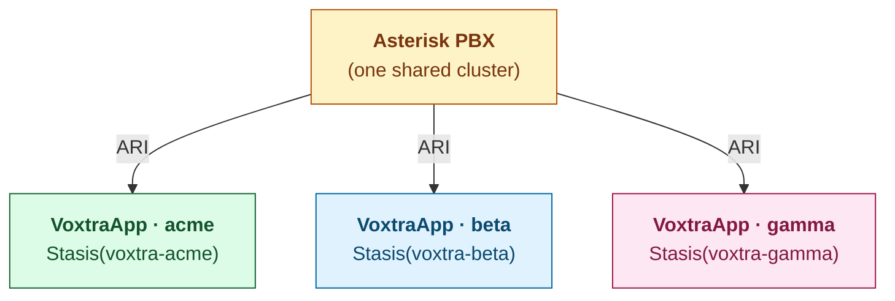

import { Callout, Steps } from 'nextra/components'

# Multi-tenant SaaS

Voxtra is designed from the ground up to host many tenants on one
Asterisk cluster. The primary isolation primitive is the **Stasis app
name** — each tenant gets its own Voxtra process subscribed to its own
Stasis app, so events for one tenant never leak into another.

## The model



Each `VoxtraApp` has:

- A unique `app_name` (e.g. `voxtra-acme`).
- Its own ARI user with a scoped password.
- Its own dialplan context routing inbound DIDs to the right Stasis app.
- Optionally its own PJSIP trunk, queues, and AudioSocket port.

## The provisioner

`TenantProvisioner` generates all the Asterisk config fragments for
a tenant from a single declarative `TenantConfig`:

```python
from voxtra.provisioning.provisioner import TenantConfig, TenantProvisioner
from voxtra.types import SIPTrunk

provisioner = TenantProvisioner(output_dir="/etc/asterisk/voxtra.d")

tenant = TenantConfig(
    tenant_id="acme-corp",
    tenant_name="ACME Corp",
    sip_trunk=SIPTrunk(
        host="sip.carrier.com",
        username="acme",
        password="s3cret",
        did="+265999123456",
    ),
    dids=["+265999123456", "+265999123457"],
    max_channels=10,
)

# Generate config fragments
files = provisioner.provision(tenant)
# files == {
#   "ari_acme-corp.conf": "...",
#   "pjsip_acme-corp.conf": "...",
#   "extensions_acme-corp.conf": "...",
# }

# Write to disk
provisioner.write_files(files)

# Trigger live reload via ARI (no SSH or asterisk -rx needed)
await provisioner.reload_asterisk(app.ari)
```

## What gets generated

### `ari_{slug}.conf`

A scoped ARI user for the tenant:

```ini
[voxtra-acme-corp]
type = user
read_only = no
password = <random-32-char>
password_format = plain
```

### `pjsip_{slug}.conf`

Endpoint, auth, AOR, registration, and identify sections for the
tenant's SIP trunk:

```ini
[voxtra-acme-corp-trunk-auth]
type = auth
auth_type = userpass
username = acme
password = s3cret

[voxtra-acme-corp-trunk-aor]
type = aor
contact = sip:sip.carrier.com:5060

[voxtra-acme-corp-trunk]
type = endpoint
context = voxtra-acme-corp-inbound
disallow = all
allow = ulaw/alaw
outbound_auth = voxtra-acme-corp-trunk-auth
aors = voxtra-acme-corp-trunk-aor
...
```

### `extensions_{slug}.conf`

Inbound dialplan routing into the tenant's Stasis app, plus optional
outbound and queue contexts:

```ini
[voxtra-acme-corp-inbound]
exten => _X.,1,NoOp(Voxtra inbound for tenant acme-corp)
 same => n,Stasis(voxtra-acme-corp)
 same => n,Hangup()

exten => 265999123456,1,NoOp(Voxtra DID +265999123456 for acme-corp)
 same => n,Stasis(voxtra-acme-corp)
 same => n,Hangup()
```

## Wire the fragments into Asterisk

In your top-level Asterisk configs, include the per-tenant directory:

```ini filename="/etc/asterisk/extensions.conf"
#include "voxtra.d/extensions_*.conf"
```

```ini filename="/etc/asterisk/pjsip.conf"
#include "voxtra.d/pjsip_*.conf"
```

```ini filename="/etc/asterisk/ari.conf"
#include "voxtra.d/ari_*.conf"
```

This pattern (the **Config Fragment Pattern**) means provisioning a
new tenant doesn't touch any pre-existing config — it just drops new
files in `voxtra.d/`.

## Live reload

`TenantProvisioner.reload_asterisk(ari)` issues
`PUT /ari/asterisk/modules/{module}` for `res_pjsip.so`,
`pbx_config.so`, and `res_ari.so` — the three modules whose configs
the provisioner touches. Per-module failures are logged and skipped;
partial reloads are valid.

```python
ari = ARIClient(base_url="http://pbx:8088", username="...", password="...")
await ari.connect()

succeeded = await provisioner.reload_asterisk(ari)
# succeeded == ["res_pjsip.so", "pbx_config.so", "res_ari.so"]
```

You can also pass an explicit module list:

```python
await provisioner.reload_asterisk(ari, modules=["res_pjsip.so"])
```

## Running the per-tenant Voxtra processes

Each tenant gets its own `VoxtraApp` process — typically one container
per tenant, scaled independently:

```python filename="tenant-acme.py"
from voxtra import VoxtraApp

app = VoxtraApp(
    ari_url="http://pbx:8088",
    ari_user="voxtra-acme-corp",       # the provisioned ARI user
    ari_password=os.environ["ARI_PW"], # store securely
    app_name="voxtra-acme-corp",
)

@app.default()
async def handle(call):
    ...

app.run()
```

Smaller deployments can host all tenants in a single process by
constructing multiple `VoxtraApp`s in the same Python program — but
you give up tenant-level isolation in failure modes.

## Onboarding flow

A typical tenant-onboarding endpoint:

<Steps>

### Receive the tenant signup

User submits org name, SIP trunk credentials, DIDs.

### Construct `TenantConfig` and provision

```python
tenant = TenantConfig(
    tenant_id=org.slug,
    tenant_name=org.name,
    sip_trunk=SIPTrunk(host=req.trunk_host, username=req.trunk_user, password=req.trunk_pw),
    dids=req.dids,
)
files = provisioner.provision(tenant)
provisioner.write_files(files)
```

### Reload Asterisk

```python
await provisioner.reload_asterisk(ari)
```

### Persist the per-tenant ARI credential

The provisioner generated a random ARI password — store it (encrypted)
so the tenant's runtime VoxtraApp can connect.

### Spawn the tenant's runtime process

Kubernetes Job, Cloud Run service, systemd unit — pick your deployment.
The process starts with the provisioned `app_name` and ARI credential.

</Steps>

## Deprovisioning

Symmetric:

```python
provisioner.deprovision(tenant_id="acme-corp")
await provisioner.reload_asterisk(ari)
# Then stop the tenant's runtime process.
```

## Channel limits per tenant

`TenantConfig.max_channels` controls the soft channel cap. The
provisioner emits `device_state_busy_at = N` on the endpoint, which
Asterisk uses for hunt-group busy signalling. Hard caps (rejecting
calls beyond N) need additional dialplan logic — track it via
`Set(GROUP(${TENANT_ID})=${UNIQUEID})` and check `GROUP_COUNT()`.

## Audit trail

Voxtra's [BackendWebhook](/voxtra/guides/webhooks) makes
multi-tenant audit straightforward — every event includes the
`session_id` and you can inspect `call.metadata` for `tenant_id`
(populate it from route metadata or channel variables).

<Callout type="info">
  In production at Luso8, tenant onboarding is fully automated: an
  admin endpoint receives the form data, the provisioner runs, and
  the tenant's process is launched as a Kubernetes Deployment within
  10 seconds.
</Callout>
